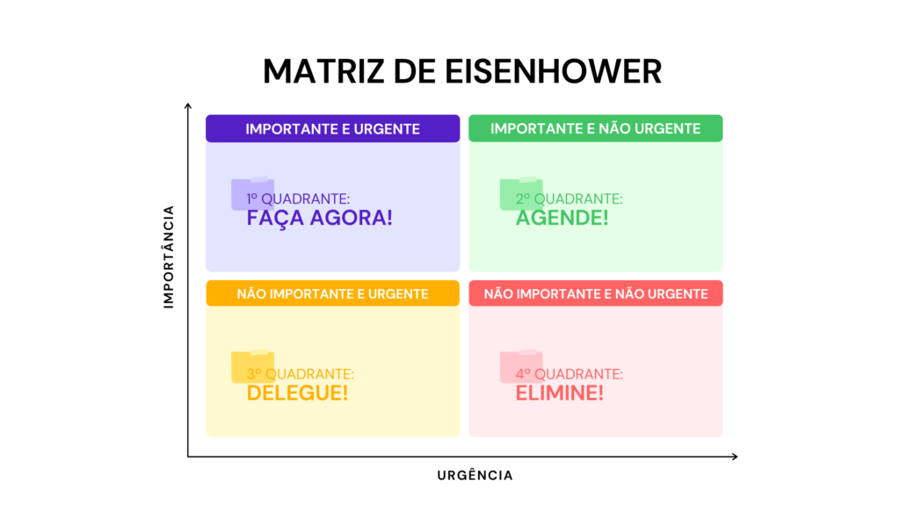

## Chapter 19 - Policy and Level

# ---

Clean Architecture tem a ideia fundamental que as politicas de niveis mais altos, não devem depender dos detalhes das politicas de níveis mais baixos. 

Uma definição de um nível de componente seria o número minimo de etapas necessárias que esse componente precisaria para alcançar a entrada e a saída. Quanto maior o nivel de etapas, maior o nível.

Por que devemos ter essa noção de nível bem clara?

As politicas de nível superior - aquelas que estão mais distante das entradas e saídas, tendem a mudar com menos frêquencia e por motivos mais importantes do que as as politicas de niveis inferiores. 
As politicas de nível inferior - aquelas que estão mais proximas das bordas (entrada e saida), tendem a mudar com mais frêquencia, e urgência, mas por motivos menos importante.

# ---

Matriz de eisenhower

